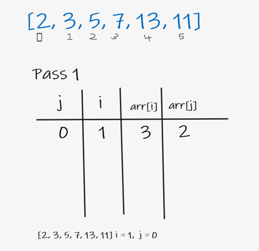
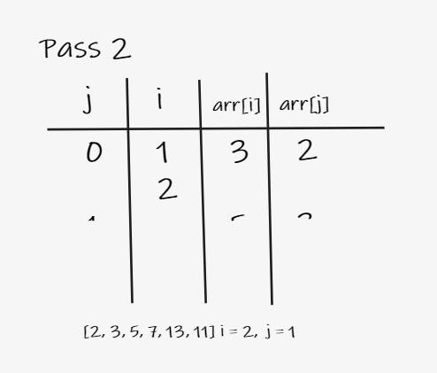
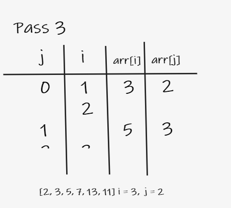
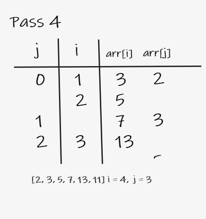
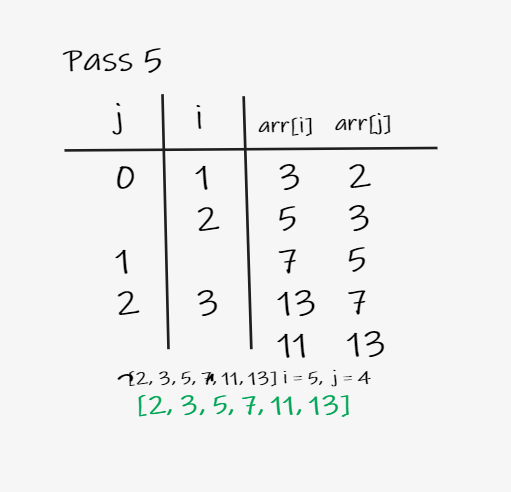

# Insertion-Sort

* Insertion sort algorithm is a simple sorting  that works similar to the way you sort playing cards in your hands. The array is virtually split into a sorted and an unsorted part. Values from the unsorted part are picked and placed at the correct position in the sorted part.

<br/>


---

## pseudo code

```py
InsertionSort( arr)

    FOR i = 1 to arr.length

       j <-- i - 1
       temp <-- arr[i]

      WHILE j >= 0 AND temp < arr[j]
        arr[j + 1] <-- arr[j]
        j <-- j - 1

      arr[j + 1] <-- temp
```
## Trace

### stage 1


### stage 2


### stage 3


### stage 4


### stage 5

---

## Efficiency

- Time: O(n^2)
> The basic operation of this algorithm is comparison. This will happen n * (n-1) number of times…concluding the algorithm to be n squared.

- Space: O(1)
> No additional space is being created. This array is being sorted in place…keeping the space at constant O(1).

---

## Code

```py
def InsertionSort(arr):
    """
    InsertionSort function --> sort an array of size n in ascending order
    """
    for i in range(1, len(arr)):
        prev = i - 1
        curr = arr[i]
        while prev >= 0 and curr < arr[prev]:
            arr[prev + 1] = arr[prev]
            prev -= 1
            arr[prev + 1] = curr
    return arr
```

## Tests

```py
def test_insertion_sort_1():
    # Arrange
    arr = [8, 4, 23, 42, 16, 15]
    # actual
    actual = InsertionSort(arr)
    # expected
    expected = [4, 8, 15, 16, 23, 42]
    assert actual == expected


def test_insertion_sort_2():
    # Arrange
    arr = [5, 12, 7, 5, 5, 7]
    # actual
    actual = InsertionSort(arr)
    # expected
    expected = [5, 5, 5, 7, 7, 12]
    assert actual == expected


def test_insertion_sort_3():
    # Arrange
    arr = [20, 18, 12, 8, 5, -2]
    # actual
    actual = InsertionSort(arr)
    # expected
    expected = [-2, 5, 8, 12, 18, 20]
    assert actual == expected


def test_insertion_sort_4():
    # Arrange
    arr = [2, 3, 5, 7, 13, 11]
    # actual
    actual = InsertionSort(arr)
    # expected
    expected = [2, 3, 5, 7, 11, 13]
    assert actual == expected
```
