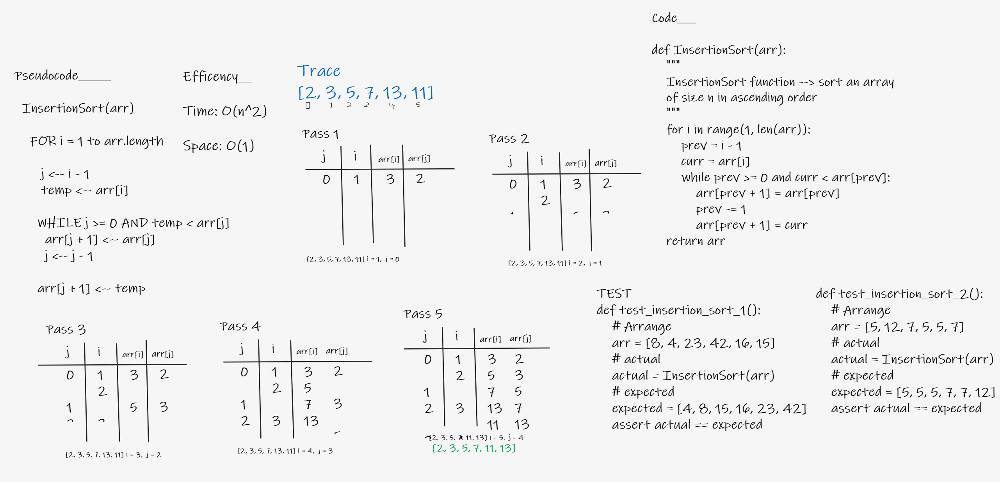

# Insertion-Sort

* Insertion sort algorithm

---

## BIG O_________

- Time: O(n^2)
- Space: O(1)

---

## Solution

- To sort an array of size n in ascending order:
> 1: Iterate from arr[1] to arr[n] over the array.

> 2: Compare the current element (key) to its predecessor.

> 3: If the key element is smaller than its predecessor, compare it to the elements before. Move the greater elements one position up to make space for the swapped element.

---

## whiteboard proces

