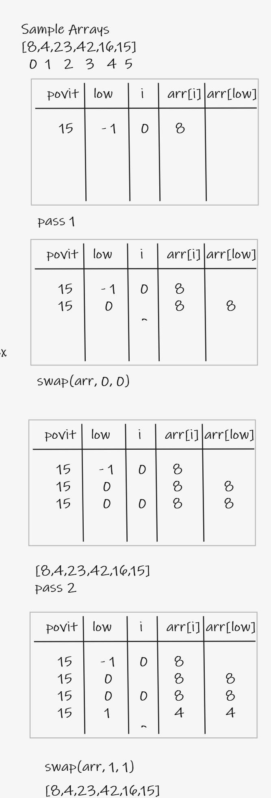
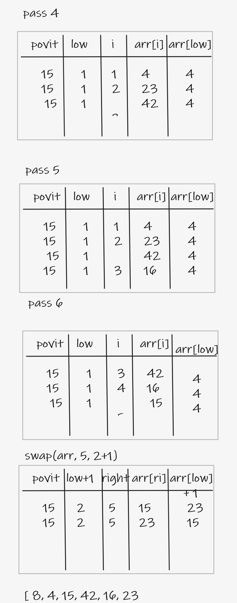
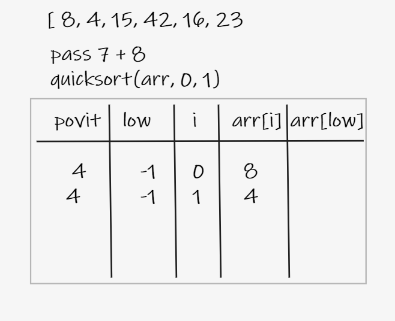
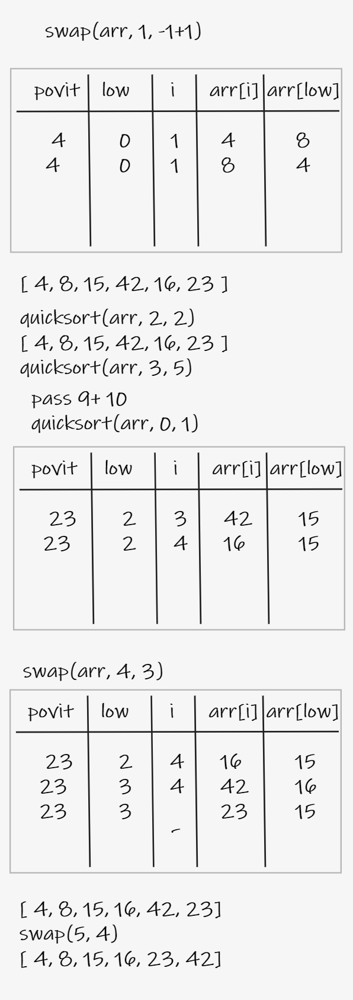

# Quick Sort
 * Like Merge Sort, QuickSort is a Divide and Conquer algorithm. It picks an element as pivot and partitions the given array around the picked pivot. There are many different versions of quickSort that pick pivot in different ways.

- Always pick first element as pivot.
Always pick last element as pivot (implemented below)
Pick a random element as pivot.
Pick median as pivot.
The key process in quickSort is partition(). Target of partitions is, given an array and an element x of array as pivot, put x at its correct position in sorted array and put all smaller elements (smaller than x) before x, and put all greater elements (greater than x) after x. All this should be done in linear time.

<br/>


---

## pseudo code

```py

ALGORITHM QuickSort(arr, left, right)
    if left < right
        // Partition the array by setting the position of the pivot value
        DEFINE position <-- Partition(arr, left, right)
        // Sort the left
        QuickSort(arr, left, position - 1)
        // Sort the right
        QuickSort(arr, position + 1, right)

ALGORITHM Partition(arr, left, right)
    // set a pivot value as a point of reference
    DEFINE pivot <-- arr[right]
    // create a variable to track the largest index of numbers lower than the defined pivot
    DEFINE low <-- left - 1
    for i <- left to right do
        if arr[i] <= pivot
            low++
            Swap(arr, i, low)

     // place the value of the pivot location in the middle.
     // all numbers smaller than the pivot are on the left, larger on the right.
     Swap(arr, right, low + 1)
    // return the pivot index point
     return low + 1

ALGORITHM Swap(arr, i, low)
    DEFINE temp;
    temp <-- arr[i]
    arr[i] <-- arr[low]
    arr[low] <-- temp
```

---

## Trace

### Stage_1

### Stage_2

### Stage_3

### Stage_4_5


---

## Efficency

* Quicksort is a logarithmic-time algorithm, in other words, it has a Big O notation of` O(log n)-(more about Big O Notation)`- and depending on the way you implement it, it can be up to 2x or even 3x faster than Merge Sort or Heap Sort. Do note that the `O(log n)` speed is a best-case/average time, in worst case scenarios it can be` O(n2)` depending on the implementation.

---

## Code

```py

def quicksort(arr, left, right):
    if left < right:
        # Partition the array by setting the position of the pivot value
        position = Partition(arr, left, right)
        # Sort the left
        quicksort(arr, left, position - 1)
        # Sort the right
        quicksort(arr, position + 1, right)
    return arr


def Partition(arr, left, right):
    # set a pivot value as a point of reference
    pivot = arr[right]
    # create a variable to track the largest index of numbers lower than the defined pivot
    low = left - 1
    print(low)
    for i in range(left, right):
        print(i)
        if arr[i] <= pivot:
            low += 1
            Swap(arr, i, low)
    # place the value of the pivot location in the middle.
    # all numbers smaller than the pivot are on the left, larger on the right.
    Swap(arr, right, low + 1)
    # return the pivot index point
    return low + 1


def Swap(arr, i, low):
    #DEFINE temp;
    temp = arr[i]
    arr[i] = arr[low]
    arr[low] = temp
```
---


## Testing

```py

def test_quicksort_1():
    # Arrange
    arr = [8, 4, 23, 42, 16, 15]
    #actual
    actual = quicksort(arr, 0, len(arr)-1)
    #expected
    expected = [4, 8, 15, 16, 23, 42]
    assert actual == expected


def test_quicksort_2():
    # Arrange
    arr = [20, 18, 12, 8, 5, -2]
    #actual
    actual = quicksort(arr, 0, len(arr)-1)
    #expected
    expected = [-2, 5, 8, 12, 18, 20]
    assert actual == expected


def test_quicksort_3():
    # Arrange
    arr = [5, 12, 7, 5, 5, 7]
    #actual
    actual = quicksort(arr, 0, len(arr)-1)
    #expected
    expected = [5, 5, 5, 7, 7, 12]
    assert actual == expected


def test_quicksort_4():
    # Arrange
    arr = [2, 3, 5, 7, 13, 11]
    #actual
    actual = quicksort(arr, 0, len(arr)-1)
    #expected
    expected = [2, 3, 5, 7, 11, 13]
    assert actual == expected
```
