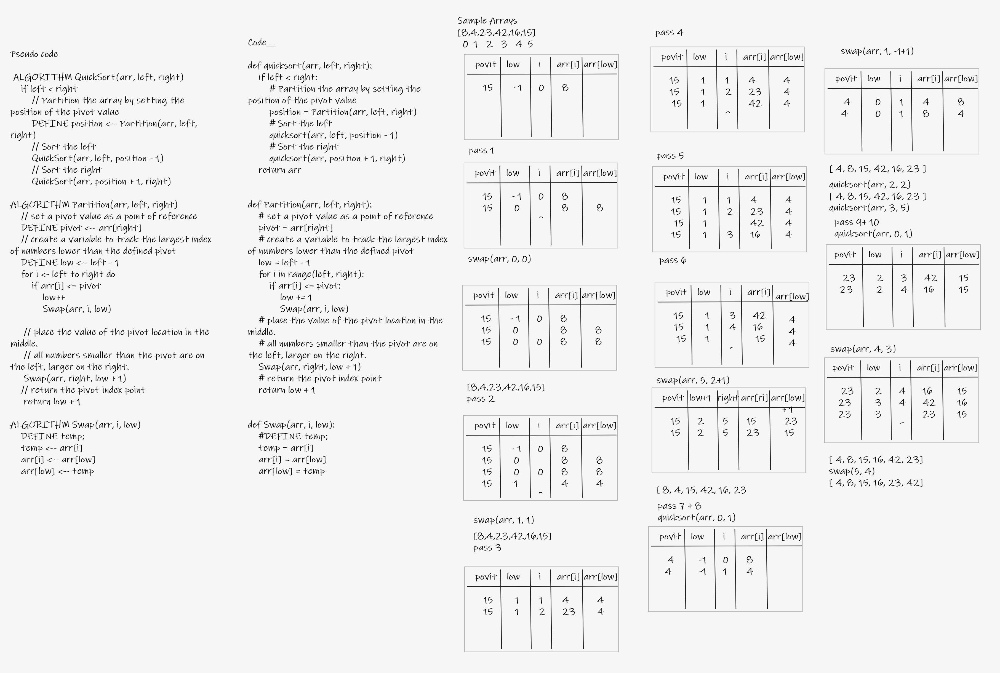

# Quick-Sort

* Quick Sort algorithm

---


## BIG O_________

- Time: O(n^2)

- Space: O(1)

---

## Solution

```py

def quicksort(arr, left, right):
    if left < right:
        # Partition the array by setting the position of the pivot value
        position = Partition(arr, left, right)
        # Sort the left
        quicksort(arr, left, position - 1)
        # Sort the right
        quicksort(arr, position + 1, right)
    return arr


def Partition(arr, left, right):
    # set a pivot value as a point of reference
    pivot = arr[right]
    # create a variable to track the largest index of numbers lower than the defined pivot
    low = left - 1
    print(low)
    for i in range(left, right):
        print(i)
        if arr[i] <= pivot:
            low += 1
            Swap(arr, i, low)
    # place the value of the pivot location in the middle.
    # all numbers smaller than the pivot are on the left, larger on the right.
    Swap(arr, right, low + 1)
    # return the pivot index point
    return low + 1


def Swap(arr, i, low):
    #DEFINE temp;
    temp = arr[i]
    arr[i] = arr[low]
    arr[low] = temp

```

---

## whiteboard proces


