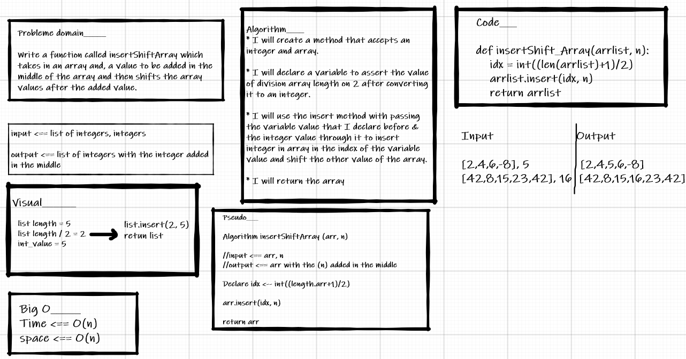

# array_insert_shift

# Insert to Middle of an Array
<!-- Description of the challenge -->

- a function called insertShiftArray which takes in an array and, a value to be added in the middle of the array and then shifts the array values after the added value.

-

## Whiteboard Process
<!-- Embedded whiteboard image -->

## Approach & Efficiency
<!-- What approach did you take? Discuss Why. What is the Big O space/time for this approach? -->

**BIG O**

- Time <== O(n)

- space <== O(n)
