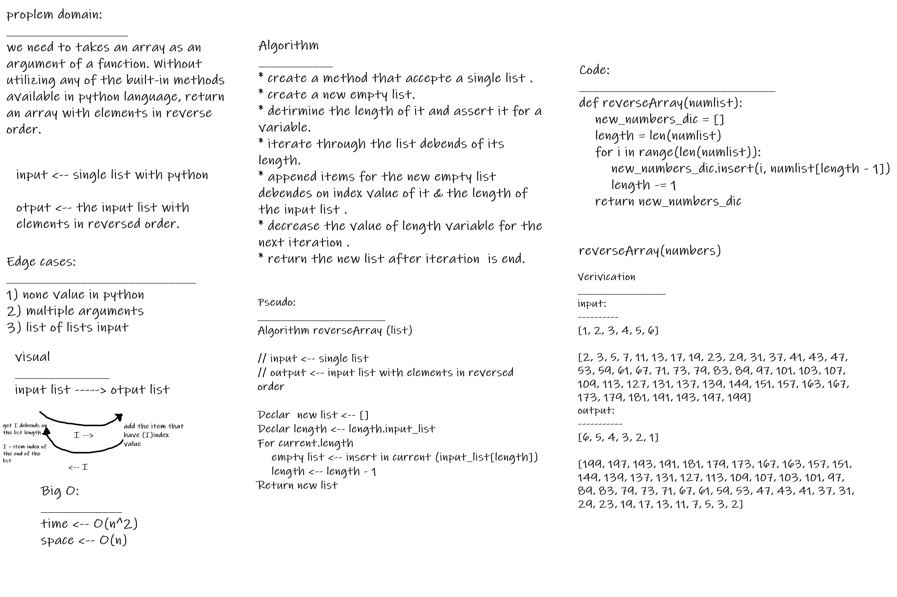

# Reverse an Array
<!-- Description of the challenge -->
* we need to takes an array as an argument of a function. Without utilizing any of the built-in methods available in python language, return an array with elements in reverse order.

## Whiteboard Process
<!-- Embedded whiteboard image -->

## Approach & Efficiency
<!-- What approach did you take? Discuss Why. What is the Big O space/time for this approach? -->
### Big O

____________
* time <-- O(n^2)

* space <-- O(n)
