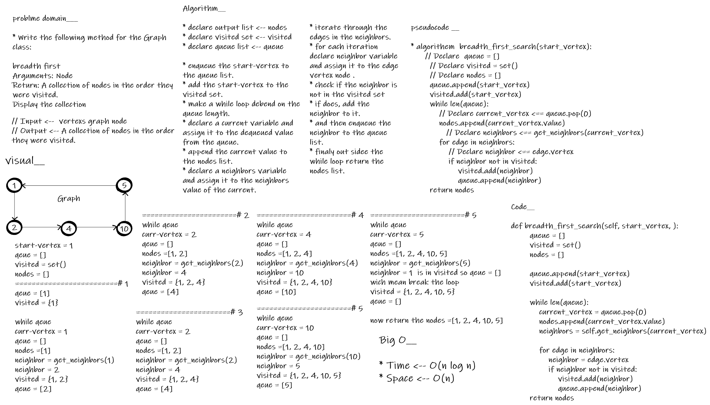
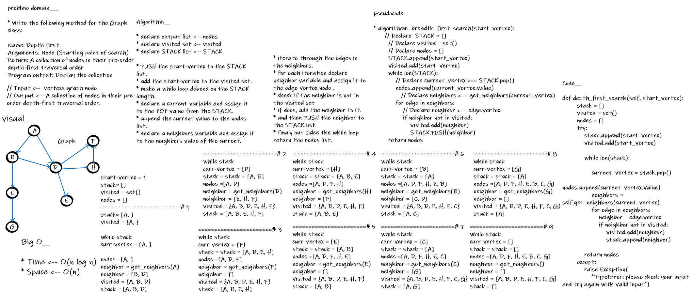

# Graph

- This Module provides means to create Graph Data Structure.

 

## Challenge

- implement Graph data-structure and manipulate it.

 

## Approach & Efficiency

- O complexity (Time and Space) for (size) method is O(1).

- O complexity (Time and Space) for (get neighbors) method is O(1).

- O complexity (Time and Space) for (get nodes) method is O(1).

- O complexity (Time) for (add edge) method is O(1).
- O complexity (Space) for (add edge) method is O(n).

- O complexity (Time) for (add node) method is O(1).
- O complexity (Space) for (add node) method is O(n).

 

## API

- size

            Arguments: none
            Returns the total number of nodes in the graph

- get neighbors

            Arguments: node
            Returns a collection of edges connected to the given node
            Include the weight of the connection in the returned collection

- get nodes

            Arguments: none
            Returns all of the nodes in the graph as a collection (set, list, or similar)

- add edge

            Arguments: 2 nodes to be connected by the edge, weight (optional)
            Returns: nothing
            Adds a new edge between two nodes in the graph
            If specified, assign a weight to the edge
            Both nodes should already be in the Graph

- add node

            Arguments: value
            Returns: The added node
            Add a node to the graph

 

## Testing Goals

- Graph

- [x] test_size_empty
- [x] test_size
- [x] test_add_edge_interloper_start
- [X] test_add_edge_interloper_end
- [X] test_get_nodes
- [x] test_get_neighbors

---------------------------------------------------------------------------
## [PR](https://github.com/BasharTaamneh/data-structures-and-algorithms/pull/40)

----

# > Graph - BFS

## Challenge

- implement Graph_BFS function.

 

## Approach & Efficiency

> Time --> O(n log n)

> Spase --> O(n)

 

## Testing Goals

- Graph_bfs

- [x] [test_graph_breadth_first_search_1](../tests/test_graph_bfs.py)
- [x] [test_graph_breadth_first_search_2](../tests/test_graph_bfs.py)

## whiteboard process

---------------------------------------------------------------------------
## [PR](https://github.com/BasharTaamneh/data-structures-and-algorithms/pull/41)

---------
# > Graph - DFS

## Challenge

- implement Graph_DFS pre-order function.

 

## Approach & Efficiency

> Time --> O(n log n)

> Spase --> O(n)

 

## Testing Goals

- Graph_dfs

- [x] [test_graph_depth_first_search_1](../tests/test_graph_dfs.py)
- [x] [test_graph_depth_first_search_2](../tests/test_graph_dfs.py)
- [x] [test_graph_depth_first_search_3](../tests/test_graph_dfs.py)
## whiteboard process

---------------------------------------------------------------------------
## [PR](https://github.com/BasharTaamneh/data-structures-and-algorithms/pull/43)
