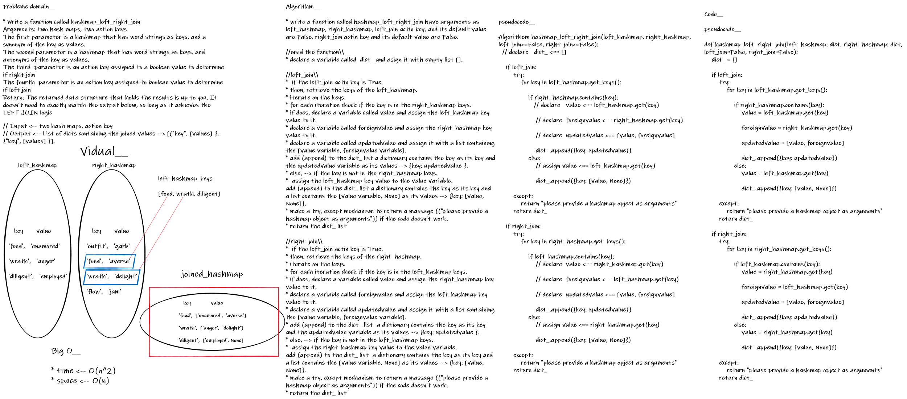

# hashmap_left_join

## Challenge

- Write a function that LEFT JOINs or RIGHT JOINstwo hashmaps into a single data structure.

<br>

---


## whiteboard proces

---

## Big O_________


- Time --> O(n^2).

- Space --> O(n).

<br>

---
## Solution

```py
def hashmap_left_right_join(left_hashmap: dict, right_hashmap: dict, left_join=False, right_join=False):
    """
    hashmap_left_right_join --> returns the joined or updated data from the left or right hashmap, depending on the action key if ( right_join OR left_join ) is True, even if there are no matches in the right table from the left table will return the original left table  updated with (None) values and versa vise.

    If the left_join action key is True it will return all data from the left_hashmap table, even if there are no matches in the right_hashmap table. If it has matches on the right_hashmap table, it'll return the values along with the corresponding data from the left_hashmap, if not, they'll be replaced by (None) value and versa vise.

    --------------------------------

    Arguments:
    ---
        left_hashmap: --> HashTable or dict
        right_hashmap: --> HashTable or dict
        left_join: --> default=False
        right_join: --> default=False

    --------------------------------

    Return: List of dicts containing the joined values --> [{"key", [values] }, {"key", [values] }].
    """
    dict_ = []

    if left_join:
        try:
            for key in left_hashmap.get_keys():

                if right_hashmap.contains(key):
                    value = left_hashmap.get(key)

                    foreignvalue = right_hashmap.get(key)

                    updatedvalue = [value, foreignvalue]

                    dict_.append({key: updatedvalue})
                else:
                    value = left_hashmap.get(key)

                    dict_.append({key: [value, None]})

        except:
            return "please provide a hashmap opject as arguments"
        return dict_

    if right_join:
        try:
            for key in right_hashmap.get_keys():

                if left_hashmap.contains(key):
                    value = right_hashmap.get(key)

                    foreignvalue = left_hashmap.get(key)

                    updatedvalue = [value, foreignvalue]

                    dict_.append({key: updatedvalue})
                else:
                    value = right_hashmap.get(key)

                    dict_.append({key: [value, None]})

        except:
            return "please provide a hashmap opject as arguments"
        return dict_

```
---


## Testing

- [x] test_hashmap_right_join_with_none_hashabl_input_1
- [x] test_hashmap_right_join_with_none_hashabl_input_2
- [x] test_hashmap_left_join_with_none_hashabl_input_1
- [x] test_hashmap_left_join_with_none_hashabl_input_2

## [PR](https://github.com/BasharTaamneh/data-structures-and-algorithms/pull/39)
