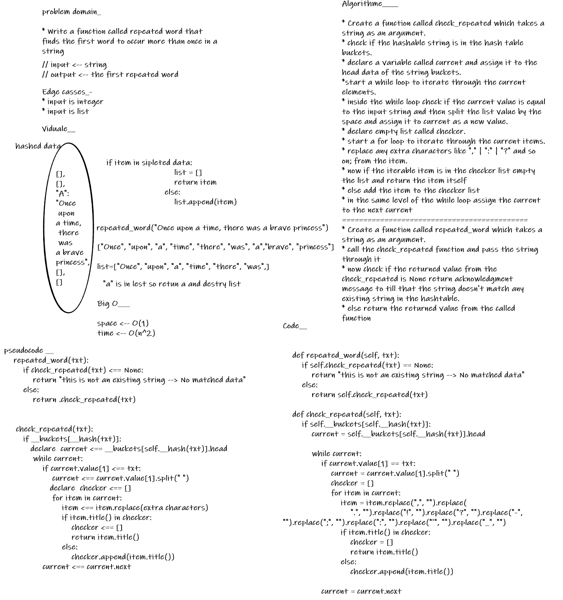

# hashmap-repeated-word

## Challenge

- Write a function called repeated word that finds the first word to occur more than once in a string.

 

---

## Features

* function called repeated word

> Arguments: string

> Return: string

---

## whiteboard proces

---

## Big O_________

- Time --> O(n^2).

- Space --> O(1).

 

---

## Testing

- [x] test_repeated_word_with_existin_string_in_hashtable
- [x] test_repeated_word_with_multiabl_existing_string_in_hashtable
- [x] test_repeated_word_with_no_existin_string_in_hashtable

