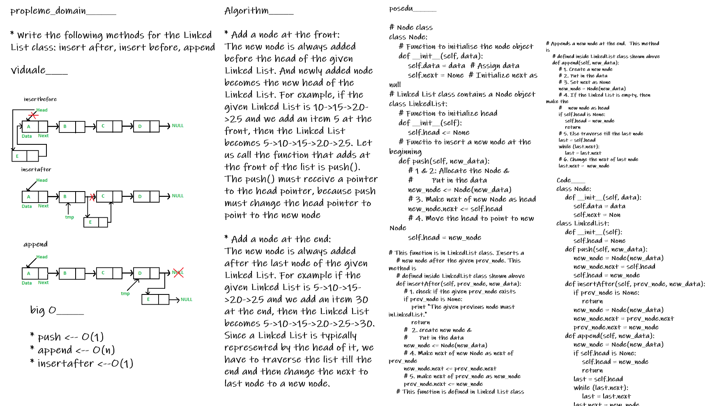

# linked-list-insertions

- methods to insert a new node in linked list. A node can be added in three ways

1) At the front of the linked list
2) After a given node.
3) At the end of the linked list.


## BIG O_________

- > push <-- O(1)
- > append <-- O(n)
- > insertafter <--O(1)

## Testing

- [x] Can successfully add a node to the end of the linked list
- [x] Can successfully add multiple nodes to the end of a linked list
- [x] Can successfully insert a node before a node located i the middle of a linked list
- [x] Can successfully insert a node before the first node of a linked list
- [x] Can successfully insert after a node in the middle of the linked list
- [x] Can successfully insert a node after the last node of the linked list

---

**methods for the Linked List class:**
```
append
----
arguments: new value
adds a new node with the given value to the end of the list
```
```
insert before
----
arguments: value, new value
adds a new node with the given new value immediately before the first node that has the value specified
```
```
insert after
---
arguments: value, new value
adds a new node with the given new value immediately after the first node that has the value specified
```
## whiteboard proces


