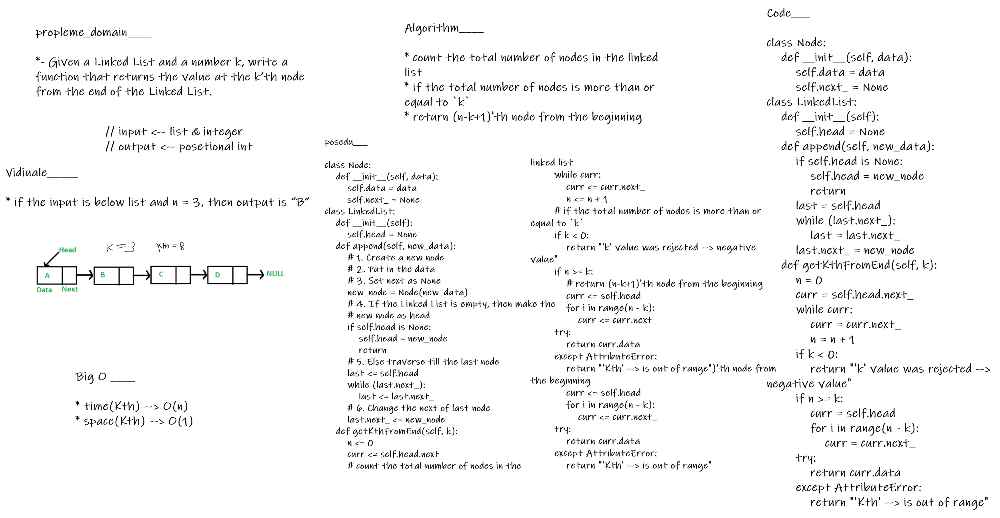

# linked-list-kth

## solution
- Find k’th node from the end of a linked list
calculate the total number of nodes n in the linked list first, then the K Th node from the end will be (n-k+1) node from the beginning.

## BIG O_________

- > time(Kth) --> O(n)
- > space(Kth) --> O(1)

## Testing

- [x] Where k is greater than the length of the linked list

- [x] Where k and the length of the list are the same

- [x] Where k is not a positive integer

- [x] Where the linked list is of a size 1

- [x] “Happy Path” where k is not at the end, but somewhere in the middle of the linked list

---

## whiteboard proces

