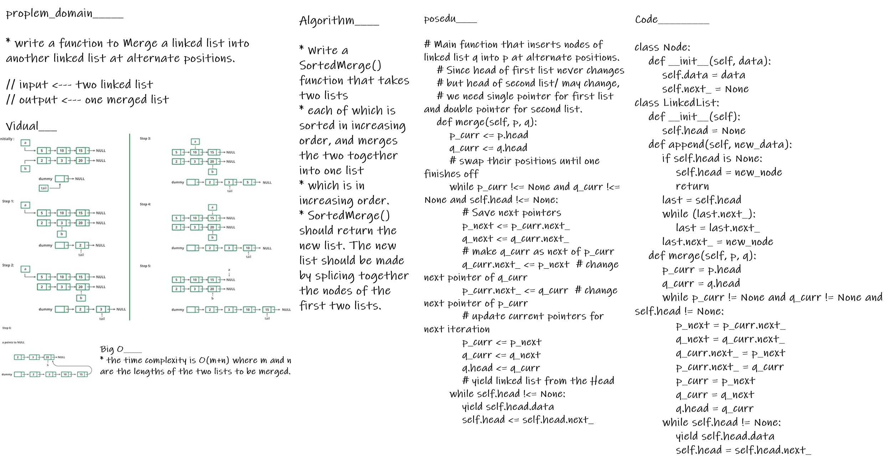

# linked_list_zip

* Merge a linked list into another linked list at alternate positions

## solution

 - The idea is to run a loop while there are available positions in first loop and insert nodes of second list by changing pointers.

## BIG O_________

* the time complexity is O(m+n) where m and n are the lengths of the two lists to be merged.

## Testing

- [x] test_zip_tow_list_printTHe_second_referance

- [x] test_zip_tow_list_printTHe_first_referance

---

## whiteboard proces

