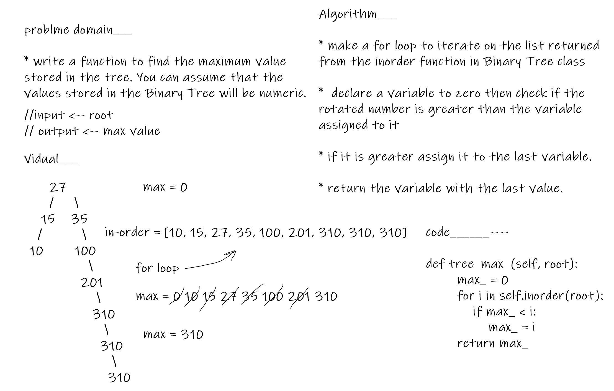

# tree-max

- write a function to find the maximum value stored in the tree. You can assume that the values stored in the Binary Tree will be numeric.

## Whiteboard Process

## BIG O_________

* the time complexity is O(n)

## Solution

- make a for loop to iterate on the list returned from the inorder function in Binary Tree class and declare a variable to zero then check if the rotated number is greater than the variable assigned to it if it is greater assign it to the last variable.
----------------
