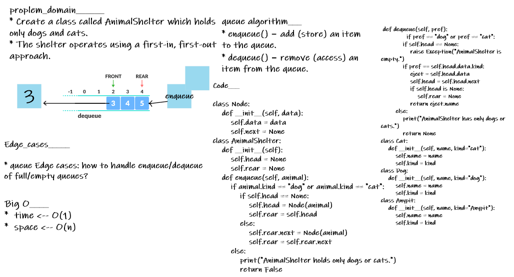

# stacks_and_queues_Animalshelter

[live PR](https://github.com/BasharTaamneh/data-structures-and-algorithms/pull/26)

## whiteboard proces

## BIG O_________
*  time <-- O(1)
*  space <-- O(n)

## Testing

- [x] test_AnimalShelter_is_empty

- [x] test_AnimalShelter_enqueue_anipt_ether_dog_or_cat

- [x] test_AnimalShelter_dequeue_anipt_ether_dog_or_cat

- [x] test_AnimalShelter_dequeue_enqueue_cat

- [x] test_AnimalShelter_dequeue_enqueue_multiable_cat

- [x] test_AnimalShelter_dequeue_enqueue_dog

- [x] test_AnimalShelter_dequeue_enqueue_multiable_dog
