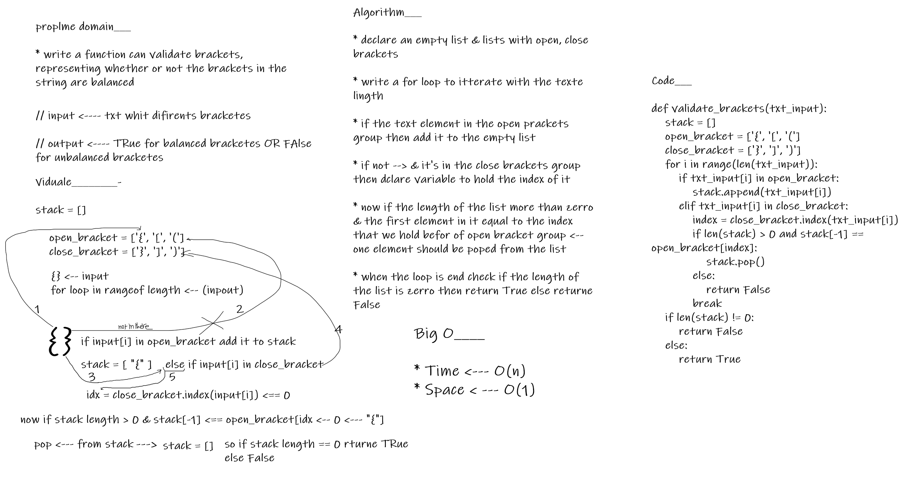

# stack_queue_brackets

* this programe can validate brackets, There are 3 types of brackets:

> Round Brackets : ()

> Square Brackets : []

> Curly Brackets : {}

- representing whether or not the brackets in the string are balanced

## solution

 - The idea is to run a for loop to get around the length of the text and check whether there is an open parenthesis and put it in a group that was defined later, but if the parenthesis is closed, we add it to the open equal, then we check the set and equality between the open and closed parenthesis and empty the set every time it is done Equality between them. If the length of the set is zero, then return True, otherwise, return False.

## BIG O_________

* Time <--- O(n)
* Space <--- O(1)

## Testing

|   input   |  output    |
|------|------|
| `{}` | TRUE |
|`{}{Code}[Fellows](())` |TRUE |
|`{}(){}`|TRUE|
|`()[[Extra Characters]]`|TRUE|
|`(){}[[]]`|TRUE|
|`[({}]`|False|
|`(](`|False|
|`{(})`|False|
|`{`|False|
|`)`|False|
|`[}`|False|
---

## whiteboard proces

