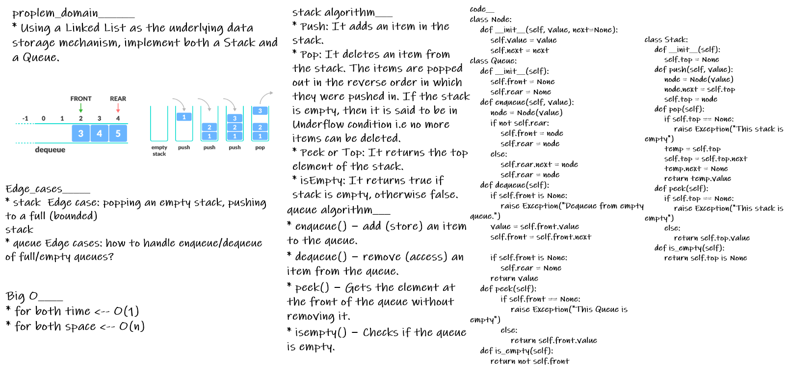

# stacks_and_queues

* A queue is a First-In, First-Out (FIFO) abstract data type. The first value added to the queue will be the first value removed from the queue. My queue is implemented by a Queue Class and offers three common operations.

* A stack is a Last-In, First-Out (LIFO) abstract data type. The last value added to the stack will be the first value removed from the stack. My stack is implemented by a Stack Class and offers four common operations.

## solution
___
**queue**__________

 - enqueue - Adds new value to the Queue.

 - dequeue - Retrieves and removes value from Queue.

 - is_empty - Returns True if the Queue is empty, othewise False.
 -  peek - Retrieves, but does not remove, value from Stack.

> All these operations are performed in constant time, **O(1)**.
___
**stack**__________

 - push - Adds new value to the Stack.
 - pop - Retrieves and removes value from Stack.
 - peek - Retrieves, but does not remove, value from - Stack.
 - is_empty - Returns True if Stack empty, othewise False.

 > All these operations are performed in constant time, **O(1)**, by pushing and popping values from the head of the linked list.

___

## Testing

- [x] Can successfully push onto a stack
- [x] Can successfully push multiple values onto a stack
- [x] Can successfully pop off the stack
- [x] Can successfully empty a stack after multiple - pops
- [x] Can successfully peek the next item on the stack
- [x] Can successfully instantiate an empty stack
- [x] Calling pop or peek on empty stack raises exception
- [x] Can successfully enqueue into a queue
- [x] Can successfully enqueue multiple values into a queue
- [x] Can successfully dequeue out of a queue the expected value
- [x] Can successfully peek into a queue, seeing the expected value
- [x] Can successfully empty a queue after multiple dequeues
- [x] Can successfully instantiate an empty queue
- [x] Calling dequeue or peek on empty queue raises exception

---
## Whiteboard Process

