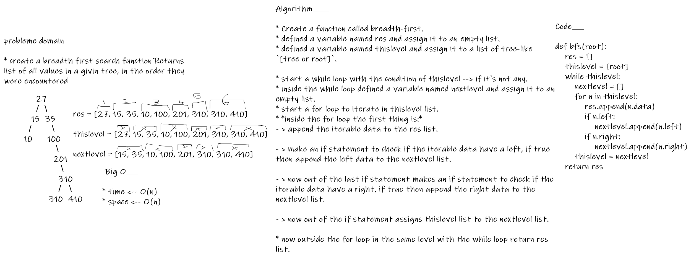

# tree-breadth-first

## Features

```
breadth first search function Returns list of all values in a givin tree, in the order they were encountered

```

## solution

Algorithm____

* Create a function called breadth-first.

* defined a variable named res and assign it to an empty list.

* defined a variable named thislevel and assign it to a list of tree-like `[tree or root]`.

* start a while loop with the condition of thislevel --> if it's not any.

* inside the while loop defined a variable named nextlevel and assign it to an empty list.

* start a for loop to iterate in thislevel list.

* *inside the for loop the first thing is:*

- > append the iterable data to the res list.
- > make an if statement to check if the iterable data have a left, if true then append the left data to the nextlevel list.
- > now out of the last if statement makes an if statement to check if the iterable data have a right, if true then append the right data to the nextlevel list.
- > now out of the if statement assigns thislevel list to the nextlevel list.

* now outside the for loop in the same level with the while loop return res list.


## Structure and Testing

> [x] test_tree_breadth_first

## Big O___

* time <-- O(n)
* space <-- O(n)


## whiteboard proces



