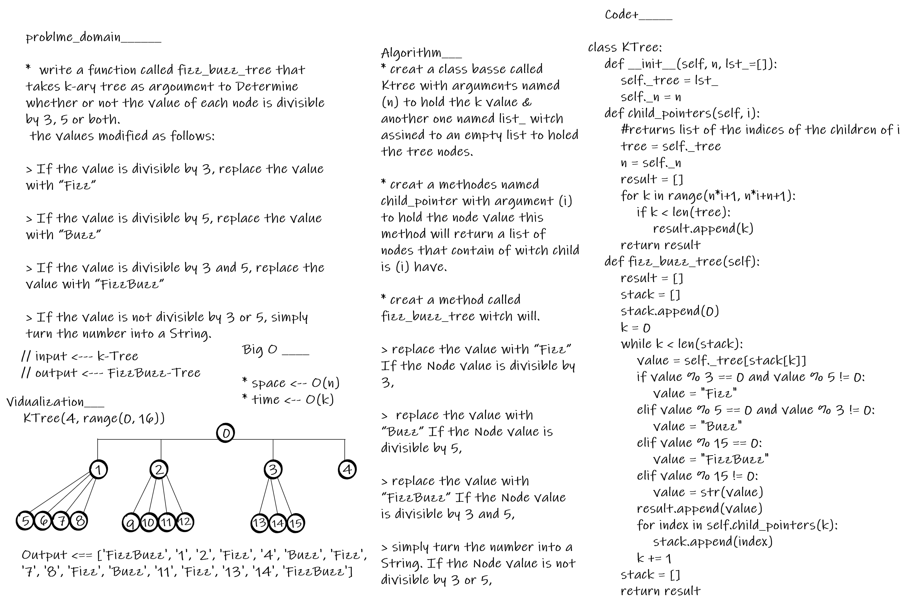

# tree_fizz_buzz

- a function called fizz_buzz_tree that takes k-ary tree as argoument to Determine whether or not the value of each node is divisible by 3, 5 or both.
 the values modified as follows:

> If the value is divisible by 3, replace the value with “Fizz”

> If the value is divisible by 5, replace the value with “Buzz”

> If the value is divisible by 3 and 5, replace the value with “FizzBuzz”

> If the value is not divisible by 3 or 5, simply turn the number into a String.

---

## BIG O_________

* the time complexity is O(k)
* the space complexity is O(n)
---

## Solution

* creat a class basse called Ktree with arguments named (n) to hold the k value & another one named list_ witch assined to an empty list to holed the tree nodes.

* creat a methodes named child_pointer with argument (i) to hold the node value this method will return a list of nodes that contain of witch child is (i) have.

* creat a method called fizz_buzz_tree witch will.

> replace the value with “Fizz”  If the Node value is divisible by 3,

>  replace the value with “Buzz” If the Node value is divisible by 5,

> replace the value with “FizzBuzz” If the Node value is divisible by 3 and 5,

> simply turn the number into a String. If the Node value is not divisible by 3 or 5,

---

## whiteboard proces

