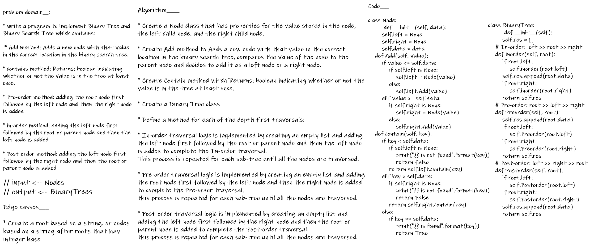
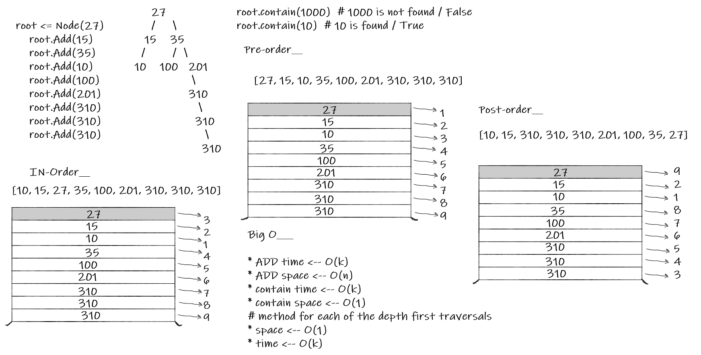

# Trees

## Features

- Node
```
Create a Node class that has properties for the value stored in the node, the left child node, and the right child node.

the following additional methods:
> Add
Arguments: value
Return: nothing
Adds a new node with that value in the correct location in the binary search tree.
> Contains
Argument: value
Returns: boolean indicating whether or not the value is in the tree at least once.

```
- Binary Tree
```
Create a Binary Tree class
Define a method for each of the depth first traversals:
> pre order
> in order
> post order which returns an array of the values, ordered appropriately.
```
## solution

Algorithm____

* Create a Node class that has properties for the value stored in the node, the left child node, and the right child node.

* Create Add method to Adds a new node with that value in the correct location in the binary search tree, compares the value of the node to the parent node and decides to add it as a left node or a right node.

* Create Contain method witch Returns: boolean indicating whether or not the value is in the tree at least once.

* Create a Binary Tree class

* Define a method for each of the depth first traversals:

* In-order traversal logic is implemented by creating an empty list and adding the left node first followed by the root or parent node and then the left node is added to complete the In-order traversal.
This process is repeated for each sub-tree until all the nodes are traversed.

* Pre-order traversal logic is implemented by creating an empty list and adding the root node first followed by the left node and then the right node is added to complete the Pre-order traversal.
this process is repeated for each sub-tree until all the nodes are traversed.

* Post-order traversal logic is implemented by creating an empty list and adding the left node first followed by the right node and then the root or parent node is added to complete the Post-order traversal.
this process is repeated for each sub-tree until all the nodes are traversed.

## Structure and Testing

> [x] Can successfully instantiate an empty tree

> [x] Can successfully instantiate a tree with a single root node

> [x] Can successfully add a left child and right child to a single root node

> [x] Can successfully return a collection from a preorder traversal

> [x] Can successfully return a collection from an inorder traversal

> [x] Can successfully return a collection from a postorder traversal

## Big O___

* ADD time <-- O(k)
* ADD space <-- O(n)
* contain time <-- O(k)
* contain space <-- O(1)
- method for each of the depth first traversals
* space <-- O(1)
* time <-- O(k)

## whiteboard proces



