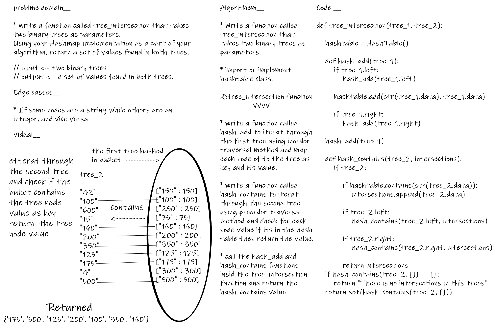

# tree_intersection

## Challenge

- Write a function called tree_intersection that takes two binary trees as parameters.
- Using your Hashmap implementation as a part of your algorithm, return a set of values found in both trees.

 

---

## Features

* function called tree_intersection

> Arguments: two Binarytree

> Return: two_tree_intersections

* function called hash_add

> Arguments: Binarytree

> Return: None

* function called hash_contains

> Arguments: Binarytree, empty list

> Return: hashtable contains values

---

## whiteboard proces

---

## Big O_________

- Time --> O(nlog(n)).

- Space --> O(n).

 

---

## Testing

- [x] test_tow_string_tree_intersections
- [x] test_tow_integers_tree_intersections
- [x] test_tow_tree_with_no_intersections

## [PR](https://github.com/BasharTaamneh/data-structures-and-algorithms/pull/38)
